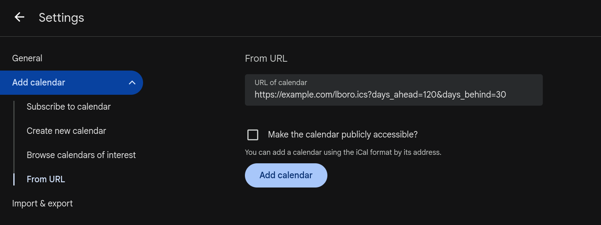
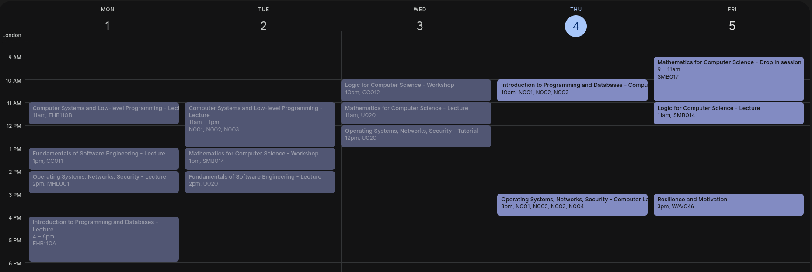

# My myLboro

Access your Loughborough University timetable through an iCal link (compatible with Google Calendar, Apple Calendar, and basically any other calendar app!)

## Usage

### Setup

You can deploy this on your own server using Docker!

1. Pick a folder and download the [production/docker-compose.yaml](production/docker-compose.yaml) file and the [.env.example](production/.env.example) file to it
2. Rename `.env.example` to `.env` and fill in your Loughborough University log-on details
3. Start the service by running the command `docker compose up -d` in that folder
4. Optional: View the log output by running `docker compose logs -f`
5. 🎉 Your timetable link is `http://YOUR_SERVER_IP:8000/lboro.ics` ("Get Calendar ICS")
   - Learn about the options you can add to the URL by viewing the API docs at `http://YOUR_SERVER_IP:8000/docs`

### Security notes

- Anyone who can send HTTP requests to your server (potentially the whole internet) can now access your university timetables! Make sure you're okay with this!
- Remember that that `.env` file contains your university login details in plain text. Make sure nobody else can access that file, and definitely don't upload it to GitHub ;)

### Add it to your calendar apps!

Add your course timetable to your favourite calendar apps and services by giving them your new `/lboro.ics` link. For example, in Google Calendar:

## Development instructions

You'll need Python and `uv`.

1. Clone repo
2. Create `.env`
3. Run `uv run fastapi dev`
4. Test it by going to <http://127.0.0.1:8000/lboro.ics>

### Development using docker

1. Clone repo
2. `cd ./development`
3. `docker compose up --build`
4. Head to <http://127.0.0.1:8000/lboro.ics>
